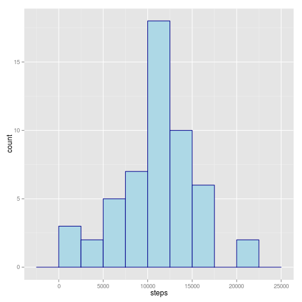
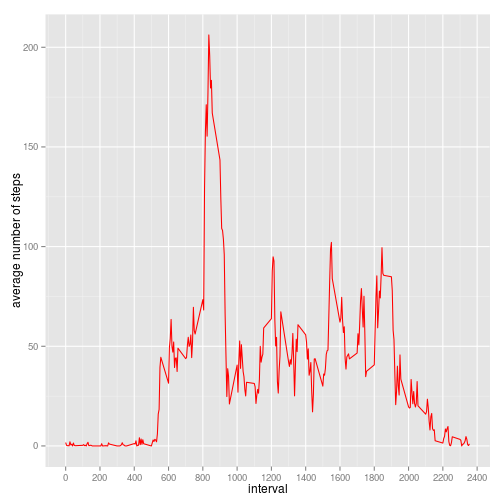
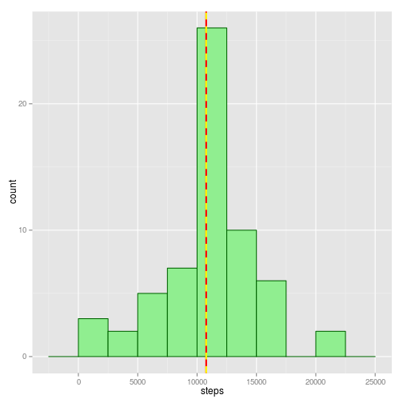
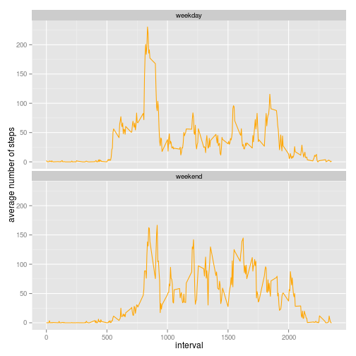

## Loading and preprocessing the data
1. Load the data

```r
dataset <- read.csv("./activity.csv")
```
2. Process/transform the data (if necessary) into a format suitable for your analysis

```r
dataset$date <- as.Date(dataset$date, format = "%Y-%m-%d")
```

## What is mean total number of steps taken per day?
1. Calculate the total number of steps taken per day

```r
total_day <- aggregate(steps ~ date, data = dataset, sum)
```

2. Make a histogram of the total number of steps taken each day

```r
library(ggplot2)
g <- ggplot(total_day, aes(steps))
g <- g + geom_histogram(color="darkblue", fill="lightblue",binwidth=2500)
print(g)
```

 

3. Calculate and report the mean and median of the total number of steps taken per day

```r
steps_mean <- mean(total_day$steps)
steps_median <- median(total_day$steps)
g <- g + geom_vline(aes(xintercept=steps_mean), color="red", size=1) +
      geom_vline(aes(xintercept=steps_median), color="yellow", linetype="dashed", size=1)
print(g)
```

 

Mean is 1.0766189 &times; 10<sup>4</sup>; Median is 10765.

## What is the average daily activity pattern?
1. Make a time series plot (i.e. type = "l") of the 5-minute interval (x-axis) and the average number of steps taken, averaged across all days (y-axis)

```r
mean_interval <- aggregate(steps ~ interval, data = dataset, mean)
p <- ggplot(mean_interval, aes(interval, steps))
p + geom_line(linetype=1, colour="red") + labs(y="average number of steps") +
      scale_x_continuous(breaks = seq(0, 2400, by=200))
```

 

2. Which 5-minute interval, on average across all the days in the dataset, contains the maximum number of steps?

```r
max_interval <- subset(mean_interval, steps == max(mean_interval$steps))
```

The 5-minute interval containing the maximum number of steps is the number 835 with an average number of steps equal to 206.1698113

## Imputing missing values
1. Calculate and report the total number of missing values in the dataset.

```r
number_of_NA <- sum(is.na(dataset))
```

The total number of missing values in the dataset is 2304

2. Devise a strategy for filling in all of the missing values in the dataset

```r
impute <- function(x, fun) {
      missing <- is.na(x)
      replace(x, missing, fun(x[!missing]))
}
```


3. Create a new dataset that is equal to the original dataset but with the missing data filled in.

```r
library(plyr)
dataset_no_NA <- ddply(dataset, ~ interval, transform, steps = impute(steps, mean))
```

The strategy used for filling in missing values is the mean of the 5-minute interval belonging to the missing value itself.  

4. Make a histogram of the total number of steps taken each day and Calculate and report the mean and median total number of steps taken per day

```r
total_day_no_NA <- aggregate(steps ~ date, data = dataset_no_NA, sum)
steps_mean_no_NA <- mean(total_day_no_NA$steps)
steps_median_no_NA <- median(total_day_no_NA$steps)

r <- ggplot(total_day_no_NA, aes(steps))
r <- r + geom_histogram(color="darkgreen", fill="lightgreen",binwidth=2500)
r <- r + geom_vline(aes(xintercept=steps_mean_no_NA), color="red", size=1) +
      geom_vline(aes(xintercept=steps_median_no_NA), color="yellow", linetype="dashed", size=1)
print(r)
```

 

Mean is 1.0766189 &times; 10<sup>4</sup>; Median is 1.0766189 &times; 10<sup>4</sup>.

Mean value do not differ from the one estimated from the dataset containing missing values; instead the median is very equal to the mean.
The only visible impact on imputing missing data is a higher number of the total number of steps taken each day 

## Are there differences in activity patterns between weekdays and weekends?
1. Create a new factor variable in the dataset with two levels – “weekday” and “weekend” indicating whether a given date is a weekday or weekend day

```r
dataset_no_NA$temp <- weekdays(dataset_no_NA$date)
dataset_no_NA$weekday <- rep("weekday", nrow(dataset_no_NA))

dataset_no_NA[grep("sabato|domenica", dataset_no_NA$temp),]$weekday <- "weekend"
dataset_no_NA <- subset(dataset_no_NA, select = -temp)
```

2. Make a panel plot containing a time series plot (i.e. type = "l") of the 5-minute interval (x-axis) and the average number of steps taken, averaged across all weekday days or weekend days (y-axis)

```r
mean_interval_weekday <- aggregate(steps ~ interval + weekday, dataset_no_NA, mean)
s <- ggplot(mean_interval_weekday, aes(interval, steps))
s + geom_line(linetype=1, colour="orange") + labs(y="average number of steps") + 
      facet_wrap(~ weekday, nrow = 2, ncol = 1)
```

 
